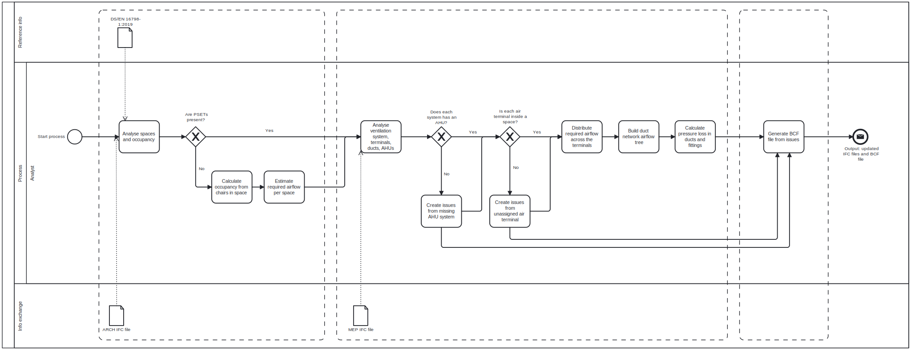

# A3 – Ventilation Analysis Tool  
### *Group 12 — Advanced BIM E25*  
**s214310 · s203493 · s201348**

---

## Table of Contents
1. [Introduction](#introduction)
2. [Module Overview](#module-overview)
   - [AirflowEstimator.py](#1-airflowestimatorpy)
   - [VentilationSystemAnalyzer.py](#2-ventilationsystemanalyzerpy)
   - [BcfGenerator.py](#3-bcfgeneratorpy)
3. [Usage](#usage)
4. [Future Work](#future-work)

---
## Summary
Title: IFC Ventilation System Analysis - Air Flow and Pressure Loss Estimation

Category: Indoor and Energy

Description: Takes two IFC files (one with IfcSpaces and one with IfcDistributionSystems), estimates the required air flow and resulting pressure loss for the ventilation system. The tool then assigns the estimations as PSETs and generates a BCF file with possible errors in the ventilation systems.

---

## Introduction

The **Ventilation Analysis Tool** is designed for use in the **early design phases** of HVAC modelling, helping identify errors or oversights during this design phase.

The tool is composed of **three independent modules** that all work independently, so feel free to replace or add features as needed :)




https://github.com/user-attachments/assets/eafb40fc-b2a2-4868-8201-dc9f506b6e8a


---

## Module Overview

### 1. AirflowEstimator.py

This module estimates airflows for all spaces present in a given IFC file (i.e. an ARCH IFC-file from the Advanced Building Design (41936) course available at DTU).

The air flows are estimated using the IEQ categories presented in the **DS_EN 16798-1:2019** international standard.

**Occupancy is determined using the following priority:**

1. Use occupancy if it is defined in a **PSET**.  
2. If no PSET is available, count the number of **chairs** in each space.  
3. If neither PSET nor chairs are found, a fallback **occupant density** is estimated using backup densities from *Appendix B in DS/EN 16798-1:2019*

Missing PSETs are automatically added and the updated IFC file is saved in the `OutputFiles` folder.

---

### 2. VentilationSystemAnalyzer.py


Quite a lot is happening in this module. But we'll try to make it short :) 
    
This module aims to analyze all present ventilation systems in a given IFC file and cross-referencing them with the spaces in a matching IFC-file containing spaces (i.e. a MEP and an ARCH IFC-file from the Advanced Building Design (41936) course available at DTU).

A number of checks are performed, if an element or a system does not pass, the analysis for this element/system does NOT continue and the elements are saved in dictionaries, for BCF generation (but we'll get to that ;) ).

#### Checks performed:

1. **AHU Assignment**  
   - Systems without an AHU are added to the `missingAHUsystems` dictionary.  
   - Systems containing an AHU are paired with supply/return systems referenced by the same AHU.

2. **Air Terminal Clash Detection**  
   - Terminals outside any space → added to `unassignedTerminals` dictionary.  
   - Terminals inside spaces proceed to the next steps.

#### Analysis steps for passing terminals and systems:

3. Divides required airflow (from room PSETs) among terminals within the space.  
4. Build data trees to visualize airflow branching.  
5. Calculate pressure loss:
   
   Now that the air flow is estimated in all elements in the system, the pressure loss can be calculated. 
   For duct elements, the pressure loss is found by calculating the hydraulic diameter (according to if the duct is rectangular or round).

   For duct fittings it gets a bit trickier, as they can be a long list of different types of fittings, i.e. duct expansions, bends, T-, and X-fittings.
   The pressure loss calculations have not been implemented for all fitting types. The ground work has been made, to determine the type of fitting and its IfcDistributionPorts.


---

### 3. BcfGenerator.py

Generates **BCF files** using the issue dictionaries generated by the previous modules.

Each issue includes:
- Camera viewpoints  
- Descriptions  
- References to offending IFC elements  

---

## Usage

1. Clone/download the repo and open it as working directory :)

2. Add your IFC-files to the `ifcFiles/` folder
   (you can also use the files in the ifcFiles copy folder)

_We used the uv package manager (<https://docs.astral.sh/uv/>) to keep track of dependencies!_

_If you have not tried uv before and would like to give it a shot, do the following:_

3. Follow the installation guide at <https://docs.astral.sh/uv/getting-started/installation/>

4. Create a virtual environment using uv

   ```uv init```

5. Add dependencies using uv

   ```uv add -r requirements.txt```

6. Run the code using uv!

   ```uv run main.py```
   
   or if you want to use the command line interface:

   ```uv run CLI_main.py```


Make sure your IFC files are placed in the `ifcFiles/` directory before running the scripts.

### Future Work

- Pressure loss estimation of duct fittings and air terminals
- Compatability with different IFC-file types. 
